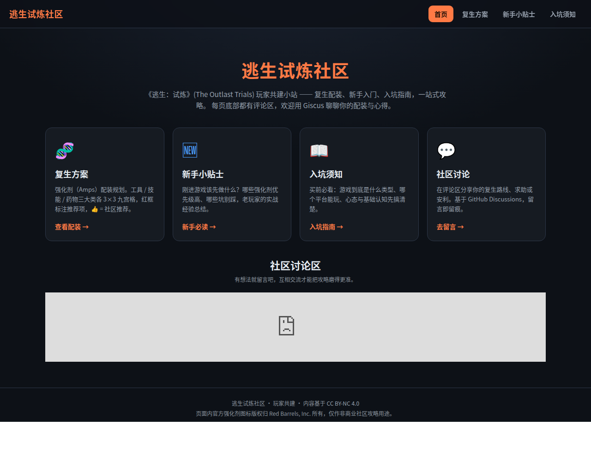

# 逃生试炼社区（玩家共建版）

《逃生：试炼》(The Outlast Trials) 玩家共建小站，**由社区共同维护**。

| 页面 | 文件 | 说明 |
|------|------|------|
| **社区首页** | [index.html](./index.html) | 站点入口，导航到各子页，底部有 Giscus 讨论区 |
| **复生方案** | [rebirth.html](./rebirth.html) | 强化剂（Amps）配装规划；三大类各 3×3 九宫格，红框圈出推荐项，👍 = 社区推荐 |
| **新手小贴士** | [newbie.html](./newbie.html) | 刚进游戏该先做什么、哪些坑别踩 |
| **入坑须知** | [getting-started.html](./getting-started.html) | 游戏类型、平台、买前必看的基础认知 |

全站特点：

- 响应式布局，适配 PC、平板、手机
- 图标外链至 `assets/icons/`（浏览器可缓存，跨页复用），不再内嵌 base64
- 每页底部都有 **Giscus 评论区**（基于 GitHub Discussions），可评论、分享配装与心得

## 本地预览

直接用浏览器打开任意 HTML 即可：

- 推荐先看 `index.html`（社区首页）
- 复生方案/强化剂配装对应 `rebirth.html`
- 图标、样式均为相对路径，无需本地服务器

## 如何参与共建

发现错误、想补充强化剂效果、或小贴士？欢迎提交 Issue 或 Pull Request。

- 详细流程、页面结构、样式规范请看 **[CONTRIBUTING.md](./CONTRIBUTING.md)**
- 快速上手：
  1. Fork 本仓库
  2. 改对应页面（如强化剂配装改 `rebirth.html`，新手内容改 `newbie.html`）
  3. 发起 PR，维护者审核合并

图标来自官方 Wiki（outlast.fandom.com），社区建议整理自贴吧讨论。

## 许可协议

本仓库文字与代码以 [CC BY-NC 4.0](./LICENSE) 发布（非商业性，署名）。
页面内官方强化剂图标版权归 Red Barrels, Inc. 所有，仅作非商业社区攻略用途。
