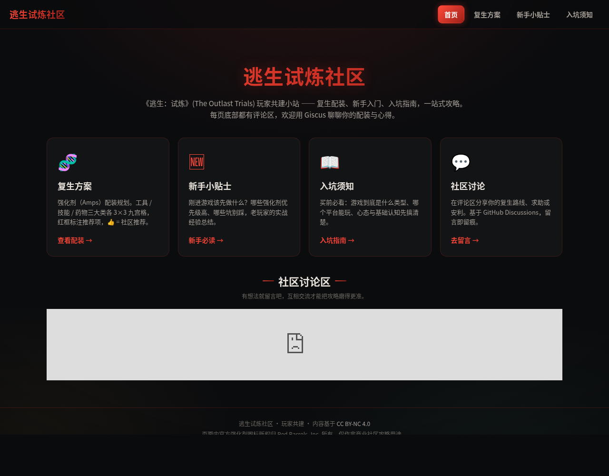
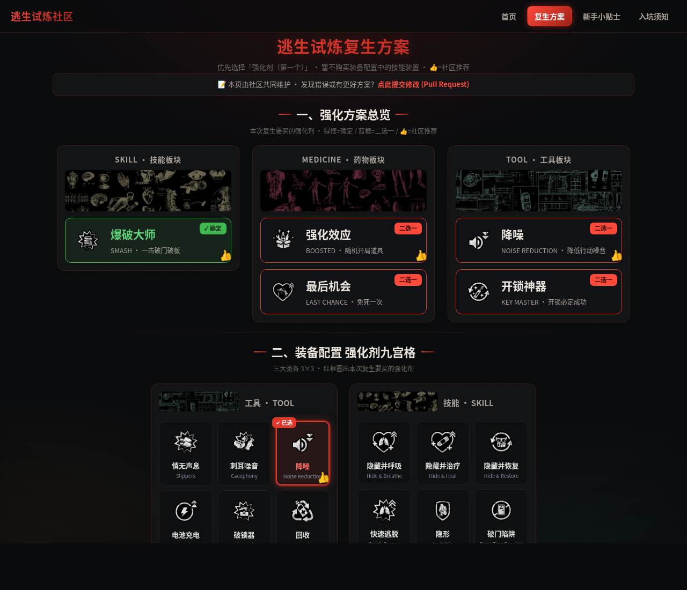

# 逃生试炼社区（玩家共建版）

《逃生：试炼》(The Outlast Trials) 玩家共建小站，攻略由社区一起维护。

? **在线访问：** https://lokeily.github.io/outlast-trials-community/

## 网站有哪些板块

| 板块 | 页面 | 这一页能干什么 |
|------|------|------|
| **社区首页** | index.html | 看新手引导路线、一键跳到各页、底部匿名留言、纠错反馈 |
| **复生方案** | rebirth.html | 看三大类强化剂 3×3 九宫格配装；红框 / ? = 社区推荐，直接抄 |
| **装备图鉴** | amp-guide.html | 查 27 强化剂 + 6 技能装置 + 处方（分等级一/二/三）；按维度或等级筛选 |
| **新手小贴士** | newbie.html | 看新手培养方案、开局要点与避坑；FAQ 可折叠展开 |
| **新闻资讯** | news.html | 看游戏简介、近期更新/补丁（官方英文译中文）；点开/收起看详情 |
| **社区讨论** | discuss.html | 全站综合讨论；各内容页底部也保留「当前页回复」 |

## 每个页面能干什么

### ? 社区首页（index.html）
- 看「新手引导・推荐路线」三步：先看新手 → 学配装 → 定复生
- 卡片一键跳到对应页面
- 底部评论区：**匿名留言**，分享配装与心得（无需登录）
- 底部「发现攻略有误，帮我们纠错」：填问卷反馈

### ? 复生方案（rebirth.html）
- 三大类强化剂（Anti、Boost、Murder…）各 3×3 九宫格配装规划
- **红框圈出 = 社区推荐项**；**? = 社区推荐**，直接照抄作业
- 下方装备图鉴看单卡效果

### ?? 装备图鉴（amp-guide.html）
- 27 种强化剂 + 6 种技能装置 + 处方（分等级一 / 二 / 三）
- 筛选条：**全部 / 核心 / 新手推荐 / 老玩家推荐**（处方按等级）
- 点卡片上的徽章也能按该维度筛选
- 每张卡有图标、中英文名与效果说明

### ? 新手小贴士（newbie.html）
- 新手培养体系方案
- 开局要点与避坑
- 可折叠的 FAQ 问答

### ? 新闻资讯（news.html）
- 游戏简介
- 近期更新 / 补丁（官方英文译中文），追最新版本动态
- 点标题展开 / 收起看详情；附赛季宣传图

### ? 社区讨论（discuss.html）
- 全站统一的综合讨论板块
- 各内容页底部另保留「当前页面内容的回复」
- 底部评论区参与讨论、纠错反馈

## 你能参与什么

- **匿名留言**：评论区无需登录、不用 GitHub 账号，直接发言。
- **纠错 / 补充**：发现攻略有误或有更好方案，点任意页面底部的「发现攻略有误，帮我们纠错」问卷告诉我们。
