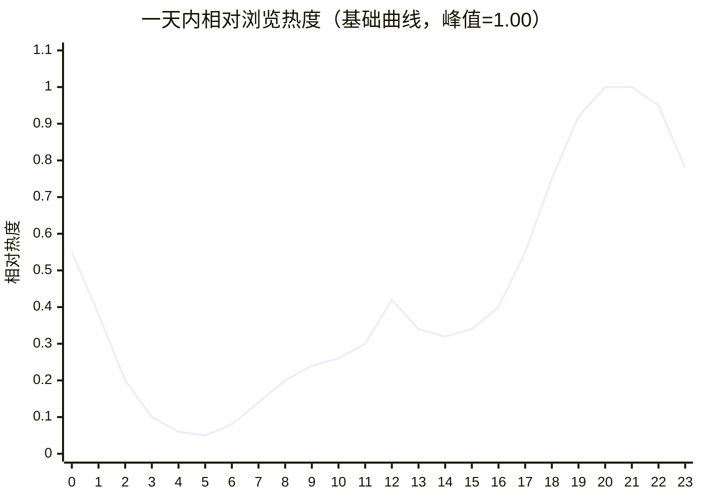

# 逃生试炼社区（玩家共建版）

《逃生：试炼》(The Outlast Trials) 玩家共建攻略小站——复生配装、装备图鉴、新手培养方案、新闻资讯与社区讨论一站直达。

🌐 **在线访问：** https://lokeily.github.io/outlast-trials-community/

---

## 当前赛季

🩸 **第七赛季 · 坟场计划（Project Boneyard）** — 2026-07-14 上线

- 🏚️ 新场景：监狱农场 + 新试验「狱长锁喉」
- 🦷 新敌人：撕咬者（The Biter）
- ♟️ 入侵 2.0：全新植入体负载系统 + 6 种装置
- 📈 升级治疗 2.0：每周主题爬升 + 排行榜
- 🎁 Twitch Drops 掉宝活动 + 献血行动社区活动（至 8 月 25 日）

---

## 页面速览

| 页面 | 缩略图 | 内容 | 评论 |
|------|--------|------|:--:|
| **社区首页** |  | 新手引导三步路线 + 各板块卡片入口 | — |
| **复生方案** |  | 工具/技能/药物三大类 3×3 九宫格，红框=推荐 | ✅ |
| **装备图鉴** |  | 27 强化剂 + 6 技能装置 + 处方分阶，可筛选 | ✅ |
| **新手小贴士** |  | 培养体系方案 + 避坑指南 + FAQ，含 S7 新系统 | ✅ |
| **新闻资讯** |  | 赛季更新 + 补丁说明 + 活动倒计时 | — |
| **社区讨论** |  | 全站综合讨论板，无需注册即可留言 | ✅ |

---

## 网站特色

### 🎯 配装攻略
- **复生方案**：红框 / 👍 标注社区推荐项，三大类各 3×3 九宫格直接抄作业
- **装备图鉴**：按核心 / 新手 / 老玩家推荐分类 + 处方按等级筛选，点徽章也能筛选
- **新手小贴士**：四阶段培养路线 + 贴吧老玩家实战经验 + 可折叠 FAQ

### 🔄 自动化功能
- **活动倒计时**：新闻页的献血活动与 Twitch Drops 每天自动更新剩余天数，到期后自动隐藏
- **背景渐进加载**：先显 inline 占位图，主图 onload 后渐显，消除首屏刷出卡顿
- **懒加载评论**：Twikoo 评论按需加载 + IntersectionObserver 预加载，不拖首屏

### 🎨 视觉设计
- 全站官方暗黑血红主题（玻璃拟态 + 微交互 + 跑马灯边框）
- Steam 官方高清宣传画虚化蒙版背景（暗角 + 氛围绕光）
- 移动端动效自动降级，prefers-reduced-motion 全部静止

### 📈 浏览人数曲线（Visitor Traffic Curve）
站点左下角的「当前在线访客」数字并非实时后端统计，而是基于**国内游戏社群作息 + 《逃生试炼》真实周律**推算出的、每天动态变化的人数曲线。曲线由四部分相乘得到：

```
时段热度 = 基础 24h 曲线 × 当日系数 × 星期系数 × (1 + 每小时微抖动)
```

**① 基础 24 小时曲线（国内作息形态）** —— 凌晨谷底、白天平台、晚 8–9 点巅峰、深夜尾巴（峰值 21 点 = 1.00）：


```mermaid
xychart-beta
    title "一天内相对浏览热度（基础曲线，峰值=1.00）"
    x-axis [0,1,2,3,4,5,6,7,8,9,10,11,12,13,14,15,16,17,18,19,20,21,22,23]
    y-axis "相对热度" 0.0 --> 1.1
    line [0.55,0.38,0.20,0.10,0.06,0.05,0.08,0.14,0.20,0.24,0.26,0.30,0.42,0.34,0.32,0.34,0.40,0.55,0.75,0.92,1.00,1.00,0.95,0.78]
```

| 时段 | 相对热度 | 说明 |
|------|---------|------|
| 0–2 点 | 0.55 / 0.38 / 0.20 | 深夜尾巴 |
| 3–5 点 | 0.10 / 0.06 / **0.05** | 谷底（大家都在睡） |
| 9–17 点 | 0.24 ~ 0.55 | 白天平台（上学/上班） |
| 18 点 | 0.75 | 下班放学，开始飙升 |
| 20–21 点 | **1.00 / 1.00** | 巅峰（打游戏主力时段） |
| 22–23 点 | 0.95 / 0.78 | 仍强，年轻人熬夜 |

**② 星期系数（以真实周律为基准）** —— 依据《逃生试炼》Steam 周均并发（tracker.gg）：**周六最高 > 周五 > 周日 > 周四 > 周一 > 周二 > 周三最低**。国内玩家基数大（累计约 250 万份、含国区定价），周末打游戏 + 看攻略人数激增：

| 星期 | 系数范围 | 说明 |
|------|---------|------|
| 周六 / 周日 | ≈ 1.70 ~ 2.06 | 显著激增（约为工作日的 2 倍） |
| 周五 | ≈ 1.12 ~ 1.37 | 晚间起飙，略高于普通工作日 |
| 周一 ~ 周四 | ≈ 0.85 ~ 1.15 | **每天各自随机**（基于日期种子），围绕 1.0 波动 |

**③ 动态性（每天都不一样）**
- **当日系数** `≈ 0.75 ~ 1.25`：用「年-月-日」做哈希种子，每天整体人流量级有波动（有的天热闹、有的天冷清），同一天刷新结果稳定。
- **每小时微抖动** `±12%`：用「种子 XOR 小时」混合哈希，相邻两天的曲线形状也不同。
- **每日偏移** `±4 人`：按日期确定的偏移，确保相邻两天、同一钟点的基线也一定不同。

**④ 最终显示的人数怎么算**
```js
基线 = max(4, round( 累计访客UV × 0.018 × (0.5 + 时段热度) )) + 每日偏移(±4)
显示值 = 围绕基线做带均值回归的随机游走（floor = 基线×0.45，ceil = 基线×1.6+4），每 10 秒更新一次
```
> 示例（假设站点累计访客 UV ≈ 2000，普通工作日、无额外系数）：凌晨 5 点基线 ≈ **20 人**，晚 21 点基线 ≈ **54 人**；周末晚 21 点可达 ≈ **100+ 人**。真实数值会随站点实际 UV 自动缩放。

---

## 参与共建

### 轻量参与（无需技术）
- 💬 到攻略页或社区讨论页底部留言，填 Steam ID 即可（无需注册）
- 📝 发现攻略有误？点任意页面底部「填写反馈问卷」

### 技术参与
- 🐛 开 Issue 报 bug / 提建议
- 🔧 Fork 后提 Pull Request 直接改内容
- 📋 详见 [CONTRIBUTING.md](CONTRIBUTING.md)

---

## 技术栈

| 项目 | 说明 |
|------|------|
| **架构** | 纯静态多页站，每个页面独立 HTML，零构建步骤 |
| **样式** | 单一 CSS 文件 `assets/css/style.css`，CSS 变量驱动主题 |
| **脚本** | 单一 JS 文件 `assets/js/site.js`，零依赖（除评论组件） |
| **评论** | Twikoo（Netlify + MongoDB Atlas 免费后端），国内可用 |
| **托管** | GitHub Pages（主分支自动部署） |
| **图标** | 游戏内真实图标（WebP/PNG 透明底），外链到官方 Wiki |

---

## 本地开发

```bash
# 直接用浏览器打开 index.html 即可预览（离线也能看）
# 或者用任意静态服务器：
npx serve .
```

修改 CSS 或 JS 后直接刷新浏览器，无需构建。

---

## 许可证

内容基于 [CC BY-NC 4.0](LICENSE)。页面内官方强化剂图标版权归 Red Barrels, Inc. 所有，仅作非商业社区攻略用途。

---

*资料截至 2026-07-27 · 第七赛季「坟场计划」*
