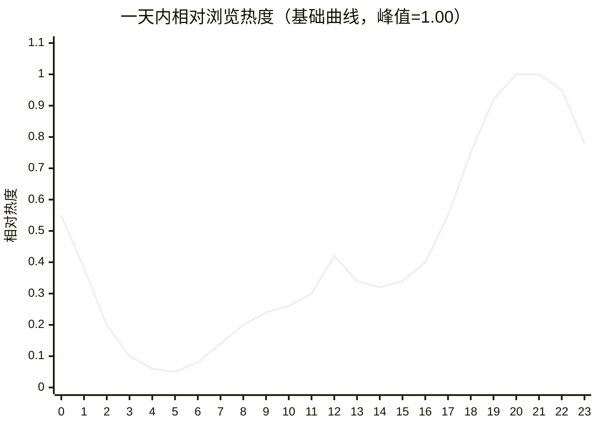

# 逃生试炼中文社区 · Outlast Trials Community

一个面向《逃生试炼（The Outlast Trials）》玩家的中文社区静态站点，托管于 GitHub Pages。

- 在线地址：https://lokeily.github.io/outlast-trials-community/
- 当前赛季：**第七赛季「Project Boneyard / 坟场计划」**（2026-07-14 上线）

---

## 浏览人数曲线（Visitor Traffic Curve）

站点左下角的「当前在线访客」数字并非实时后端统计，而是基于**国内游戏社群作息 + 《逃生试炼》真实周律**推算出的、每天动态变化的人数曲线。曲线由三部分相乘得到：

```
时段热度 = 基础 24h 曲线 × 当日系数 × 星期系数 × (1 + 每小时微抖动)
```

### 1. 基础 24 小时曲线（国内作息形态）

凌晨谷底、白天平台、晚 8–9 点巅峰、深夜尾巴。数值为相对热度（峰值 21 点 = 1.00）：


```mermaid
xychart-beta
    title "一天内相对浏览热度（基础曲线，峰值=1.00）"
    x-axis [0,1,2,3,4,5,6,7,8,9,10,11,12,13,14,15,16,17,18,19,20,21,22,23]
    y-axis "相对热度" 0.0 --> 1.1
    line [0.55,0.38,0.20,0.10,0.06,0.05,0.08,0.14,0.20,0.24,0.26,0.30,0.42,0.34,0.32,0.34,0.40,0.55,0.75,0.92,1.00,1.00,0.95,0.78]
```

| 时段 | 相对热度 | 说明 |
|------|---------|------|
| 0–2 点 | 0.55 / 0.38 / 0.20 | 深夜尾巴 |
| 3–5 点 | 0.10 / 0.06 / **0.05** | 谷底（大家都在睡） |
| 9–17 点 | 0.24 ~ 0.55 | 白天平台（上学/上班） |
| 18 点 | 0.75 | 下班放学，开始飙升 |
| 20–21 点 | **1.00 / 1.00** | 巅峰（打游戏主力时段） |
| 22–23 点 | 0.95 / 0.78 | 仍强，年轻人熬夜 |

### 2. 星期系数（以真实周律为基准）

依据《逃生试炼》Steam 周均并发（tracker.gg）：**周六最高 > 周五 > 周日 > 周四 > 周一 > 周二 > 周三最低**。国内玩家基数大（累计约 250 万份、含国区定价），周末打游戏 + 看攻略人数激增。

| 星期 | 系数范围 | 说明 |
|------|---------|------|
| 周六 / 周日 | ≈ 1.70 ~ 2.06 | 显著激增（约为工作日的 2 倍） |
| 周五 | ≈ 1.12 ~ 1.37 | 晚间起飙，略高于普通工作日 |
| 周一 ~ 周四 | ≈ 0.85 ~ 1.15 | **每天各自随机**（基于日期种子），围绕 1.0 波动 |

### 3. 动态性（每天都不一样）

- **当日系数** `≈ 0.75 ~ 1.25`：用「年-月-日」做哈希种子，每天整体人流量级有波动（有的天热闹、有的天冷清），同一天刷新结果稳定。
- **每小时微抖动** `±12%`：用「种子 XOR 小时」混合哈希，相邻两天的曲线形状也不同。
- **每日偏移** `±4 人`：按日期确定的偏移，确保相邻两天、同一钟点的基线也一定不同。

### 4. 最终显示的人数怎么算

```js
基线 = max(4, round( 累计访客UV × 0.018 × (0.5 + 时段热度) )) + 每日偏移(±4)
显示值 = 围绕基线做带均值回归的随机游走（floor = 基线×0.45，ceil = 基线×1.6+4），每 10 秒更新一次
```

> 示例（假设站点累计访客 UV ≈ 2000，普通工作日、无额外系数）：
> 凌晨 5 点基线 ≈ **20 人**，晚 21 点基线 ≈ **54 人**；周末晚 21 点可达 ≈ **100+ 人**。
> 真实数值会随站点实际 UV 自动缩放。

---

## 技术栈

- 纯静态 HTML / CSS / 原生 JS，无构建步骤。
- 评论：Twikoo（Netlify + MongoDB 后端）。
- 页脚「总浏览人次」与在线人数兜底：不蒜子（busuanzi）被拦截时自动走本地兜底估算。
- 部署：推送至仓库 `main` 分支，GitHub Pages 自动构建。
