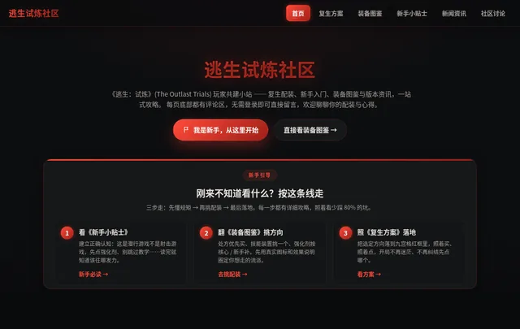
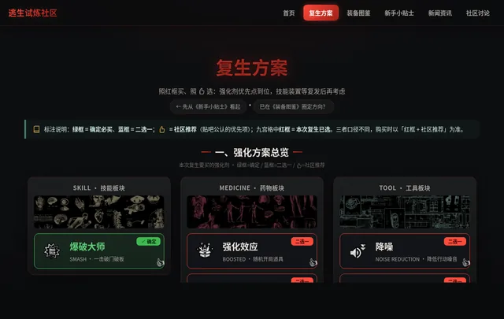
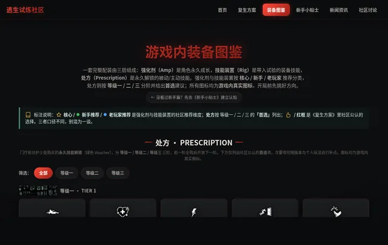
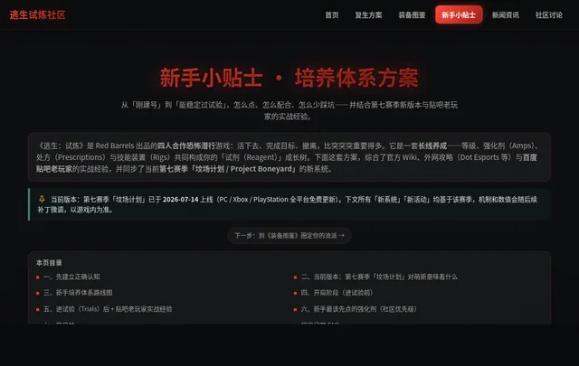
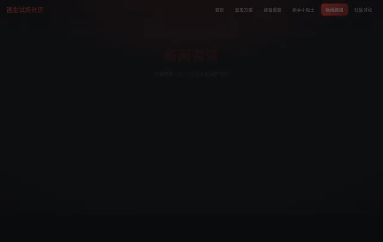
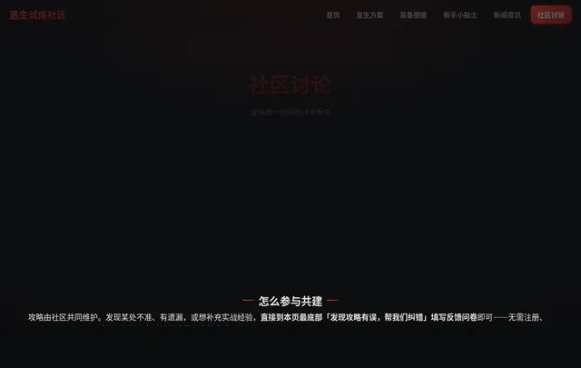

# 逃生试炼社区（玩家共建版）

《逃生：试炼》(The Outlast Trials) 玩家共建小站，攻略由社区一起维护。

🌐 **在线访问：** https://lokeily.github.io/outlast-trials-community/

## 各页面截图（当前网站实拍）

|  |  |  |
| :--: | :--: | :--: |
| 社区首页 | 复生方案 | 装备图鉴 |
|  |  |  |
| 新手小贴士 | 新闻资讯 | 社区讨论 |

## 网站有哪些板块

| 板块 | 页面 | 这一页能干什么 | 评论区 |
|------|------|------|:--:|
| **社区首页** | index.html | 看新手引导路线、一键跳到各页、纠错反馈入口 | — |
| **复生方案** | rebirth.html | 看三大类强化剂 3×3 九宫格配装；红框 / 👍 = 社区推荐，直接抄 | ✅ |
| **装备图鉴** | amp-guide.html | 查 27 强化剂 + 6 技能装置 + 处方（分等级一/二/三）；按维度或等级筛选 | ✅ |
| **新手小贴士** | newbie.html | 看新手培养方案、开局要点与避坑；FAQ 可折叠展开 | ✅ |
| **新闻资讯** | news.html | 看游戏简介、近期更新/补丁（官方英文译中文）；点开/收起看详情 | — |
| **社区讨论** | discuss.html | 全站综合讨论板块，集中交流、分享配装、提问安利 | ✅ |

> 首页与新闻资讯为纯浏览页，不设评论区；想留言请到「社区讨论」或任意攻略页底部。

## 每个页面能干什么

### 🏠 社区首页（index.html）
- 看「新手引导·推荐路线」三步：先看新手 → 学配装 → 定复生
- 卡片一键跳到对应页面
- 底部「发现攻略有误，帮我们纠错」：填问卷反馈，或跳转到社区讨论区留言

### 🧬 复生方案（rebirth.html）
- 三大类强化剂（Anti、Boost、Murder…）各 3×3 九宫格配装规划
- **红框圈出 = 社区推荐项**；**👍 = 社区推荐**，直接照抄作业
- 页底评论区可分享自己的配装方案

### 🛠️ 装备图鉴（amp-guide.html）
- 27 种强化剂 + 6 种技能装置 + 处方（分等级一 / 二 / 三）
- 筛选条：**全部 / 核心 / 新手推荐 / 老玩家推荐**（处方按等级）
- 点卡片上的徽章也能按该维度筛选
- 每张卡有图标、中英文名与效果说明；页底评论区可补充配装思路

### 🌱 新手小贴士（newbie.html）
- 新手培养体系方案
- 开局要点与避坑
- 可折叠的 FAQ 问答；页底评论区可交流上手心得

### 📰 新闻资讯（news.html）
- 游戏简介
- 近期更新 / 补丁（官方英文译中文），追最新版本动态
- 点标题展开 / 收起看详情；附赛季宣传图（纯浏览页，不设评论）

### 💬 社区讨论（discuss.html）
- 全站统一的综合讨论板块，集中交流、分享配装、提问与安利
- 攻略页（复生方案 / 装备图鉴 / 新手小贴士）底部也保留「当前页面内容的回复」
- 底部同样有「发现攻略有误，帮我们纠错」反馈入口

## 评论区说明

- **轻量留言**：评论区基于 **Twikoo**，无需注册登录、不用 GitHub 账号，填上你的 **Steam ID 名称**即可发言（仅昵称必填，无需邮箱和网址）。
- **国内可用**：后端采用 **Netlify + MongoDB Atlas 免费方案**，国内访问顺畅。
- **哪些页有评论**：复生方案、装备图鉴、新手小贴士、社区讨论；首页与新闻资讯为纯浏览页，不设评论。

## 你能参与什么

- **轻量留言**：到攻略页或社区讨论页底部，填上 Steam ID 名称即可发言，无需注册。
- **纠错 / 补充**：发现攻略有误或有更好方案，点任意页面底部的「发现攻略有误，帮我们纠错」问卷告诉我们。
- **共建内容**：想直接改攻略内容，可 Fork 后提 Pull Request，详见 [CONTRIBUTING.md](CONTRIBUTING.md)。

## 技术说明

- **纯静态多页站**：每个页面都是独立 HTML，共享 `assets/css/style.css` 与 `assets/js/site.js`，**无需任何构建步骤**，直接用浏览器打开即可预览。
- **部署**：托管于 GitHub Pages。
- **评论后端**：Twikoo 云函数（Netlify）+ MongoDB Atlas，前端环境地址配置在 `assets/js/site.js` 的 `TWIKOO_ENV_ID`。

---

内容基于 [CC BY-NC 4.0](LICENSE)；页面内官方强化剂图标版权归 Red Barrels, Inc. 所有，仅作非商业社区攻略用途。
